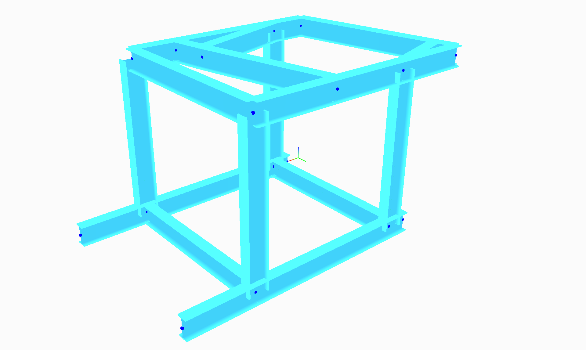
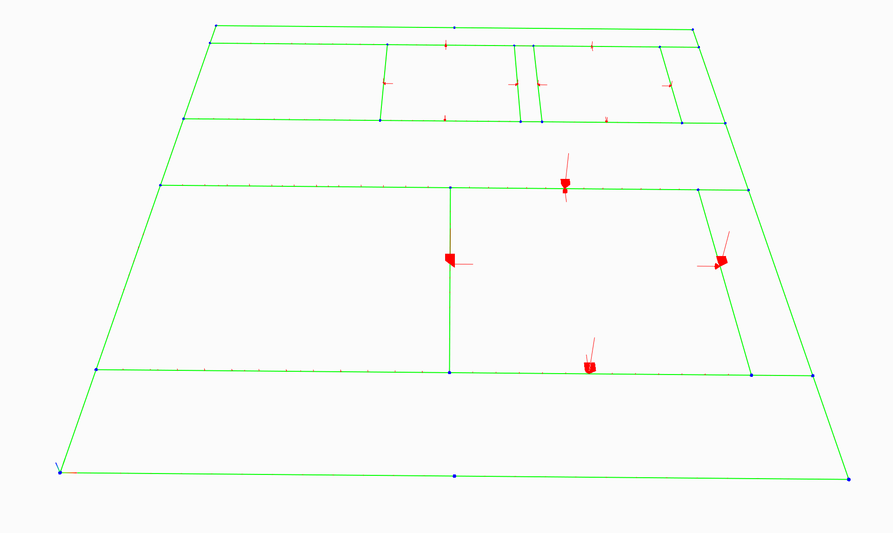
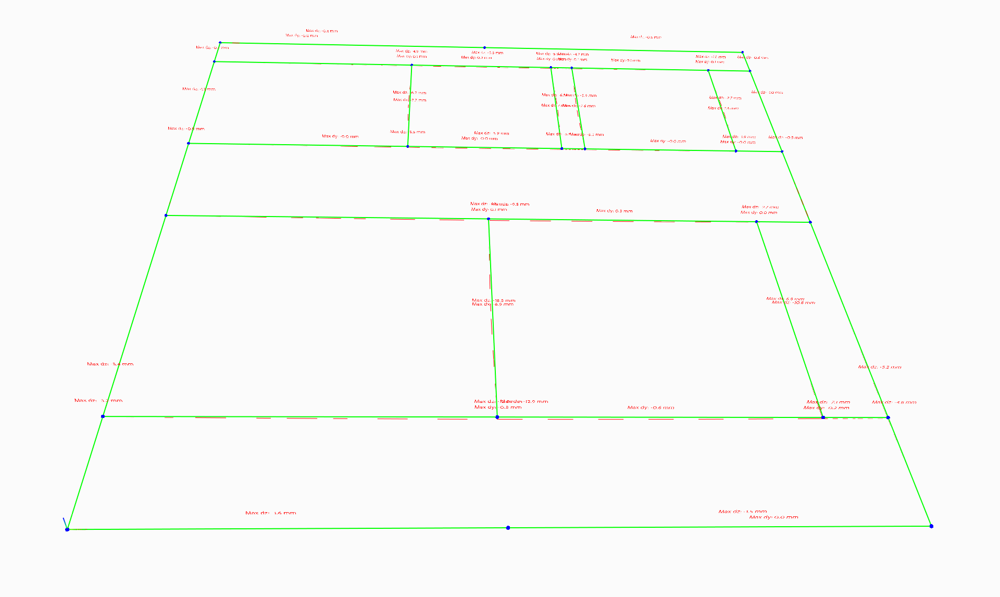

## edsFEM

edsFEM is an open source, simple, 3d, frame analysis software package.

For simple static structural mechanics, it is the perfect solution.

It is usable by setting up a structural model, including beams, supports and loads in a script.

Using these scripts it is possible to render model geometry and results of the analysis in a simple gui.

## Features

- edsFEM supports static structural mechanical in three dimensions.
- A profile library containing all standard EU profiles is included in the profiles module.
- Renderer capable of rendering the model and results.
- View support conditions and member end releases in the gui.
- View applied loads and moments and the resulting moment, shear and normal force lines along the beams.
- Render and view displacements.
- Apply distributed loads across beams and surfaces easily.
- A simple optimizer to minimize structure weight.

## Examples

Examples of these scripts are found in the [examples](examples/) folder.

|3d Model industrial floor system| Loading |
|---|---|
|||
|Moment lines about local y| Moment lines about local z|
|||
|Normal stresses output| Displacement output |
|||

## How it functions

edsFEM functions like a traditional FE-software. In its current iteration it limited to beam elements.

All user input, such as geometry, mechanical properties, supports and loads are assembled into a stiffness matrix and load vector for the entire system.

Using a solver supplied in the scipy package, the matrix equation containing the stiffness matrix, displacement vector and load vector is solved for the displacement vector.

Subsequently a postprocessor handles the process of making the results of solving the system viewable for the end user and determining internal forces and stresses in the system.

## How to install

To use edsFEM, you need to have the Python programming language installed.

To be able to use edsFEM to its full extents, you need the additional packages listed here;

|Functionality|packages|Website|
|---|---|---|
|edsFEM|numpy|http://www.numpy.org/|
||scipy|https://www.scipy.org/|
|Renderer|panda3d|https://www.panda3d.org/|
||PIL|https://pillow.readthedocs.io/en/stable/|
